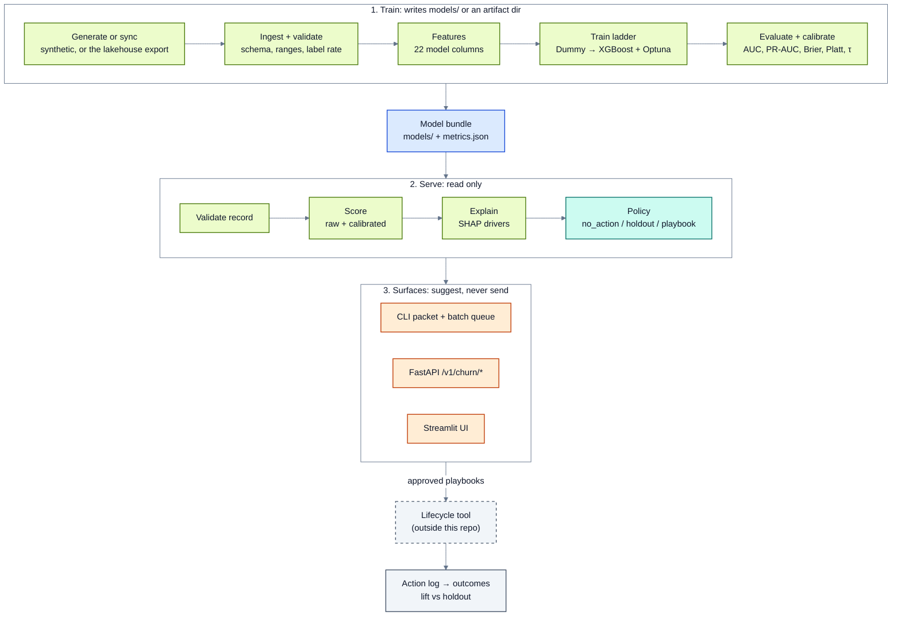
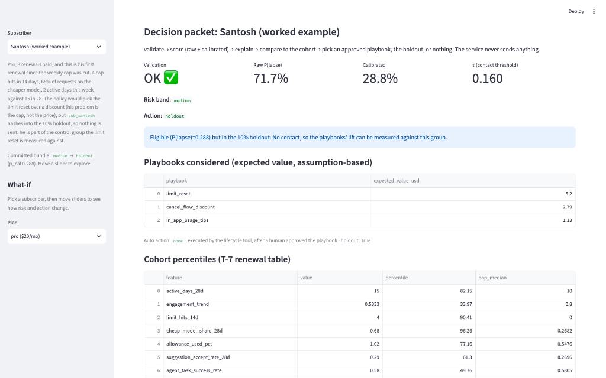

# Retention Radar

**Score every subscription renewal seven days ahead, explain the risk, and suggest one measured action, with a holdout so you can prove what works.**

[](https://github.com/santoshshinde2012/retention-radar/actions/workflows/ci.yml)
[](LICENSE)
[](runtime.txt)

## What it is

Retention Radar is an open-source renewal-risk service for a monthly AI coding assistant plan
(Pro $20 · Pro+ $60 · Ultra $200). Seven days before each renewal (T-7) it:

1. **scores** the chance that the subscriber lets the plan lapse, with a calibrated probability;
2. **explains** the score with the top SHAP drivers;
3. **suggests** one human-approved playbook (a limit reset, a pause offer, a cancel-flow discount, or a
   personal email on Ultra), or no action;
4. **keeps a 10% holdout**, so the lift of every playbook can be measured.

The service suggests; it never sends (`auto_action` is always `none`). The data is synthetic (seed 42, no
real people), and the mechanisms behind it come from the public record: cap hits, rationing to a cheaper
model, surprise overage bills, the first renewal after a pricing change. Sources and limits:
[docs/use-case.md](docs/use-case.md).

**Who it is for:** ML engineers, data scientists and product analysts who want a complete, honest
example of a churn model that goes all the way from training to a decision, with the boundaries a real
team needs: a clear label, a fixed contract, calibration, a holdout and tests.

## Architecture



Training may write the bundle; serving only reads it. Every surface (CLI, API, Streamlit) uses the same
validation, scoring and policy code. Module map and the decision rules:
[docs/architecture.md](docs/architecture.md); diagram rules: [docs/diagrams.md](docs/diagrams.md).

## Quick start

You need Python 3.12+ and a CPU; nothing else. On macOS, `make setup` points XGBoost and LightGBM at
scikit-learn's bundled OpenMP library when Homebrew's `libomp` is missing.

```bash
git clone https://github.com/santoshshinde2012/retention-radar.git
cd retention-radar
make setup        # .venv + pinned requirements + the package (editable)
make test         # the full test suite on the committed seed-42 bundle
make infer        # score Santosh -> artifacts/santosh_decision_packet.json
make use-cases    # one renewal day: queue -> packets -> send export -> outcomes and lift
make ui           # Streamlit UI on the committed model (Ctrl+C to stop)
```



More screenshots: [docs/README.md](docs/README.md#screenshots).

A quick retrain that leaves the committed `models/` alone:

```bash
RETENTION_RADAR_ARTIFACT_DIR=artifacts/smoke N_USERS=800 N_OPTUNA_TRIALS=5 make run
```

## Data sources and commands

| Data source | Set with | What it is for |
|---|---|---|
| Synthetic (default for tests and published numbers) | `CHURN_DATA_SOURCE=synthetic` | The seed-42 renewal cohort behind the committed `models/` |
| Lakehouse gold | `CHURN_DATA_SOURCE=lakehouse`, or `make run-lakehouse LAKEHOUSE_ROOT=…` | The feature table that [local-data-lakehouse](https://github.com/santoshshinde2012/local-data-lakehouse) builds from raw events; writes under `artifacts/lakehouse_run/` |

| Command | What it does |
|---|---|
| `make setup` | Create `.venv`, install the pinned requirements and the package, fix OpenMP on macOS |
| `make test` · `make lint` · `make docs-check` | Pytest (synthetic data); Ruff; file names and Markdown links |
| `make run` | Full pipeline: generate, train the ladder, calibrate, evaluate (writes `models/` unless `RETENTION_RADAR_ARTIFACT_DIR` is set) |
| `make reproduce` | Retrain into `artifacts/repro/` and compare with `models/metrics.json` |
| `make infer` | Santosh's decision packet |
| `make use-cases` · `make build-use-cases` | Walk one renewal day; rebuild the `data/use_cases/` pack |
| `make api` · `make ui` | Local FastAPI (`/v1/churn/score`, `/batch`, `/actions`; no auth) · Streamlit UI |
| `make run-lakehouse` | Train and score on a local-data-lakehouse export |
| `make e2e-local` | Everything CI checks: reproduce, tests, CLI, live API and UI, lakehouse run, isolation |

## Results

The published numbers come from the committed seed-42 bundle (8,000 synthetic subscribers, 7,329 T-7
rows, 9.6% base rate). Everything is in **[results/](results/README.md)**.

| Model (test set) | AUC |
|---|---:|
| Logistic regression | **0.781** |
| CatBoost | 0.765 |
| Random forest | 0.758 |
| XGBoost + Optuna (served, Platt-calibrated) | 0.757 |
| LightGBM | 0.736 |
| XGBoost, default | 0.729 |
| Dummy | 0.500 |

Calibrated XGBoost serves today; on this result a real deployment should move to the linear model, as
[results/benchmarks.md](results/benchmarks.md) explains.

| Worked example | Raw → calibrated P(lapse) | Band | Action |
|---|---|---|---|
| Santosh: Pro, 4 cap hits in 14 days, 68% of requests on the cheap model, first renewal since the cap cut | 0.717 → **0.288** | medium | `holdout`: in the control group, so nothing is sent; would have got `limit_reset` |
| Arjun: Pro+, 12 renewals, 66% of his allowance used, no cap hits | 0.124 → **0.025** | low | `no_action` |

**Scoring the lakehouse export** (2026-10-03, local-data-lakehouse run from empty volumes,
[results/lakehouse-consume-e2e.md](results/lakehouse-consume-e2e.md)): 7,387 renewals built from raw
events, all scored by the committed bundle in one batch.

| Action | Renewals |
|---|---:|
| `no_action` | 6,499 |
| `cancel_flow_discount` | 410 |
| `limit_reset` | 276 |
| `pause_offer` | 111 |
| `holdout` (control group, nothing sent) | 87 |
| `personal_email` (Ultra, written by a person) | 4 |

`auto_action` is `none` on every row.

## Documentation

| Doc | What you will find |
|---|---|
| [docs/guides/start-here.md](docs/guides/start-here.md) | Clone, run one command, what to read next |
| [docs/getting-started.md](docs/getting-started.md) | Install, run, score, and walk one renewal day |
| [docs/use-case.md](docs/use-case.md) | The business problem, the evidence, and what synthetic data can and cannot show |
| [docs/architecture.md](docs/architecture.md) | Train and serve boundary, modules, the decision policy |
| [docs/model-card.md](docs/model-card.md) | Intended use, data, training setup, seed-42 metrics, holdout design, limitations, versioning |
| [docs/README.md#screenshots](docs/README.md#screenshots) | The Streamlit UI on the worked example: predict, explain, decision |
| [docs/data/data-dictionary.md](docs/data/data-dictionary.md) | The 24-field T-7 record |
| [docs/data/data-foundation-lakehouse.md](docs/data/data-foundation-lakehouse.md) | Building the same table from events in the lakehouse |
| [results/README.md](results/README.md) | Benchmarks (metrics and run times), worked examples, the lakehouse consume run, plots |
| [docs/README.md](docs/README.md) | The full docs index, including guides and case studies |

## How the two repos connect

[local-data-lakehouse](https://github.com/santoshshinde2012/local-data-lakehouse) is the **data
foundation**: it builds the same T-7 feature table from raw billing and usage events, point in time, and
exports it. This repo is the **model and decision service**: it validates that export against the record
schema, scores it and suggests actions. The contract is two files, `churn_user_features.csv` and
`hero_inference_record.json`, checked on both sides.

```mermaid
%%{init: {"theme": "base", "flowchart": {"wrappingWidth": 360}, "themeVariables": {"primaryColor": "#CCFBF1", "primaryTextColor": "#0F172A", "primaryBorderColor": "#0F766E", "lineColor": "#64748B", "textColor": "#0F172A", "edgeLabelBackground": "#FFFFFF", "clusterBkg": "#FFFFFF", "clusterBorder": "#64748B", "titleColor": "#0F172A", "attributeBackgroundColorOdd": "#FFFFFF", "attributeBackgroundColorEven": "#F0FDFA", "relationColor": "#64748B", "relationLabelBackground": "#FFFFFF", "relationLabelColor": "#0F172A"}}}%%
flowchart LR
  subgraph lake ["local-data-lakehouse"]
    EV["Bronze events<br/>billing + usage<br/>(make churn-sample)"]
    SP["Spark 4.1.3 + Iceberg 1.12<br/>bronze → silver → gold<br/>(make churn-e2e)"]
    CAT["Lakekeeper REST catalog<br/>+ RustFS object store"]
    EXP["data/export/<br/>churn_user_features.csv<br/>hero_inference_record.json<br/>churn_renewals_audit.csv"]
    CON["Export contract<br/>check_churn_export.py --strict"]
  end
  subgraph radar ["retention-radar"]
    SYNC["Sync + ingest<br/>CHURN_DATA_SOURCE=lakehouse"]
    MOD["Committed model bundle<br/>models/ (seed 42)"]
    SC["Batch score<br/>ranked action queue"]
    PK["Decision packet<br/>score, band, drivers, action"]
  end
  EV --> SP
  SP -->|"commits Iceberg tables"| CAT
  SP --> EXP
  EXP --> CON
  CON -->|"radar_consume.sh"| SYNC
  SYNC --> SC
  MOD --> SC
  SC --> PK
  classDef storage fill:#DBEAFE,stroke:#1D4ED8,color:#0F172A,stroke-width:1.5px
  classDef catalog fill:#FEF3C7,stroke:#B45309,color:#0F172A,stroke-width:1.5px
  classDef compute fill:#ECFCCB,stroke:#4D7C0F,color:#0F172A,stroke-width:1.5px
  classDef orchestration fill:#FCE7F3,stroke:#BE185D,color:#0F172A,stroke-width:1.5px
  classDef graphlayer fill:#CCFBF1,stroke:#0F766E,color:#0F172A,stroke-width:1.5px
  classDef consumer fill:#FFEDD5,stroke:#C2410C,color:#0F172A,stroke-width:1.5px
  classDef data fill:#F1F5F9,stroke:#475569,color:#0F172A,stroke-width:1.5px
  class EV,EXP data
  class SP compute
  class CAT catalog
  class CON graphlayer
  class SYNC,SC compute
  class MOD storage
  class PK consumer
```



```bash
# in local-data-lakehouse, after make churn-e2e (or make churn-gold-local):
./pipelines/radar_consume.sh                                # clones this repo, syncs, batch-scores
# or, from this repo, retrain and score on that export:
make run-lakehouse LAKEHOUSE_ROOT=../local-data-lakehouse
```

Details: [docs/data/data-foundation-lakehouse.md](docs/data/data-foundation-lakehouse.md) here, and the
lakehouse [README](https://github.com/santoshshinde2012/local-data-lakehouse#readme) and
[RESULTS.md](https://github.com/santoshshinde2012/local-data-lakehouse/blob/main/RESULTS.md) there.

## Testing and CI

| Check | Command | What it proves |
|---|---|---|
| Unit and contract tests | `make test` | Scoring, policy, packets, API, use cases, docs, diagrams, file names and links |
| Seed-42 canary | `pytest -q tests/test_seed42_canary.py` | Santosh's and Arjun's scores never move silently |
| Reproduction | `make reproduce` | A retrain matches `models/metrics.json` (exact on Linux x86-64) |
| Everything | `make e2e-local` | The full local check that CI runs |

[CI](.github/workflows/ci.yml) has two jobs on every pull request: `test` (canary, Ruff, file names and
links, a smoke retrain, pytest, a drift check) and `e2e-local` (the seed-42 reproduction, every serve
surface, and the lakehouse E2E against the local-data-lakehouse branch of the same name, or `main`).

## Troubleshooting

| Symptom | Fix |
|---|---|
| XGBoost or LightGBM fails to load on macOS (libomp) | Re-run `./scripts/fix_macos_libomp.sh .venv` (part of `make setup`), or `brew install libomp` |
| `Python 3.12+ required` from `make setup` | `make setup PYTHON=python3.12` |
| A retrain on Apple Silicon differs from `models/metrics.json` in the third decimal | Expected: the bundle was trained on Linux x86-64; CI checks the exact numbers |
| Tests read a local lakehouse export by mistake | Run them with `CHURN_DATA_SOURCE=synthetic` (`make test` does) |
| `make run` replaced the committed `models/` | `git checkout -- models/`, and set `RETENTION_RADAR_ARTIFACT_DIR` next time |

## Contributing

Contributions are welcome. [CONTRIBUTING.md](CONTRIBUTING.md) covers set-up, tests, the file-naming
convention (`make docs-check`) and the diagram rules. Changes are recorded in [CHANGELOG.md](CHANGELOG.md).
Report security problems privately as described in [SECURITY.md](SECURITY.md); everyone taking part follows the
[code of conduct](CODE_OF_CONDUCT.md).

## Licence

MIT © Santosh Shinde. See [LICENSE](LICENSE).
