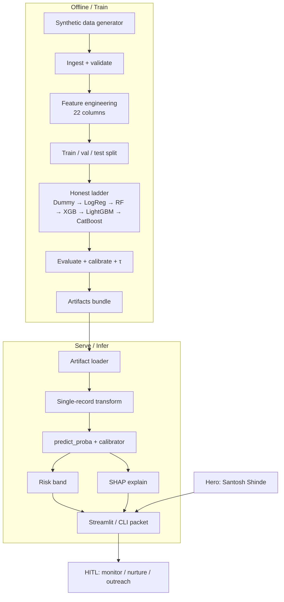
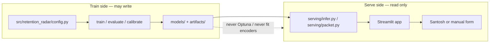
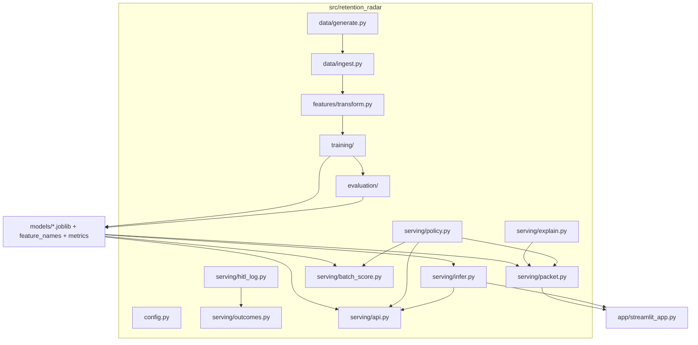

# Architecture — Retention Radar (XGBoost AI Platform Churn)

**Model card:** [MODEL_CARD.md](MODEL_CARD.md) · **Landscape:** [ALGORITHM_LANDSCAPE.md](guides/ALGORITHM_LANDSCAPE.md) · **Practices:** [BEST_PRACTICES.md](guides/BEST_PRACTICES.md) · **Lakehouse:** [data-foundation-lakehouse.md](data/data-foundation-lakehouse.md) · **Results:** [../results/BENCHMARKS.md](../results/BENCHMARKS.md)

## Purpose

End-to-end view of the fictional AI-platform **Retention Radar**: synthetic data through Streamlit single-record inference for **Santosh Shinde**. All components are FOSS (Python, pandas, scikit-learn, XGBoost, LightGBM, CatBoost, Optuna, SHAP, Streamlit).

The radar ranks quiet fade-out risk and hands a flight checklist to a human — it does not auto-act.

## End-to-end flow




## Train vs serve boundary




- **Train** may write models, metrics, plots, calibrators.
- **Serve** must not fit encoders, call Optuna, or regenerate labels.
- Shared: feature name list (22), threshold/band config, version metadata, [MODEL_CARD.md](MODEL_CARD.md).

## Module map



```text
retention-radar/
├── src/retention_radar/   # packages: data, features, training, evaluation, serving
├── src/retention_radar/cli/  # python -m retention_radar.cli.train, .infer, …
├── app/streamlit_app.py
├── scripts/run_all.sh
├── data/raw/      # users.csv, santosh_shinde.json
├── models/        # churn_xgb.joblib, calibrator, feature_names.json, metrics.json
├── artifacts/     # plots + santosh_decision_packet.json
├── docs/          # dictionary, checklist, lakehouse notes, result charts
├── docs/ARCHITECTURE.md / docs/MODEL_CARD.md
├── results/  # BENCHMARKS + plots + Santosh analysis
├── data/external/ # lakehouse gold sync (gitignored)
└── scripts/       # run_all.sh + run_lakehouse_e2e.sh
```

**Contracts:** config in → artifacts out → UI reads artifacts only. Dictionary and `feature_names.json` must agree.

## Pipeline stages

| Stage | Responsibility | Typical outputs |
|-------|----------------|-----------------|
| Generate | Synthetic users + noisy `churned`; inject Santosh | `users.csv`, `santosh_shinde.json` |
| Ingest / validate | Schema, ranges, label rate, hero row | Clean table + fail-fast errors |
| Features | Select columns, encode `plan_tier` | `X`, `y` (22 model features) |
| Train / tune | Stratified splits, imbalance, baselines, Optuna on **val** | Best params, fitted model |
| Evaluate | AUC, PR, F1, Brier, τ, latency | `metrics.json`, plots |
| Infer | Load bundle, score one row | Probability + band + drivers |
| UI | Presets, forms, Decision tab | Streamlit HITL |
| Batch score | Gold CSV → scores.csv / JSONL | `cli.batch_score` |
| Thin API | Local `POST /v1/churn/score` | `serving/api.py` (no auth) |
| HITL log | Append review decisions | `cli.hitl_log` + configs/templates |
| Outcomes | Join reviews → later labels | `cli.hitl_outcomes` → `hitl_outcomes.{csv,json}` |
| Ops-lite | Drift, retrain, when not to ship | guides/BEST_PRACTICES.md |

## Key artifacts contract

| File | Consumer |
|------|----------|
| `models/churn_xgb.joblib` | `infer`, Streamlit |
| `models/calibrator.joblib` | calibrated `p` for bands |
| `models/feature_names.json` | Transform order (22) for Santosh’s vector |
| `models/feature_stats.json` | Outlier flags, drift reference, cohort-percentile fallback |
| `models/metrics.json` | MODEL_CARD.md tables |
| `artifacts/santosh_decision_packet.json` | Case study + CI canary |
| Risk thresholds / bands | `infer.risk_band`, UI chips |
| `MODEL_CARD.md` | Humans; fill metrics after `run_all` |

## Runtime views

**Batch / offline:** `./scripts/run_all.sh` → compare metrics → update model card.  
**Batch gold scores:** `python -m retention_radar.cli.batch_score` → `artifacts/predictions/scores.csv`.  
**Interactive:** Streamlit → load Santosh → edit → score + SHAP.  
**Thin API:** `uvicorn retention_radar.serving.api:app --app-dir src` → `POST /v1/churn/score`.  
**Canary:** freeze Santosh JSON; diff `P(churn)` after retrain (reference **0.043 / 0.016** · monitor).

## Non-goals

- Live billing or CRM write-back  
- Multi-tenant auth  
- GPU serving  
- Paid feature stores or AutoML  

**In scope (optional teaching serve):** a thin local FastAPI app (`serving/api.py`) with `POST /v1/churn/score` (conceptual alias `POST /v1/churn:score`). No auth — localhost teaching only. Streamlit remains the interactive HITL UI.

## SOLID map (packages → principles)

The layout is a **teaching** SOLID sketch, not a claim that every file is a textbook example. Callers depend on small Protocols so Dummy, LogReg, and XGBoost can swap at score time.

| Package / module | SRP | OCP | LSP | ISP | DIP |
|------------------|-----|-----|-----|-----|-----|
| `config.py` | One place for paths, seed, 22-column contract | Extend features via config, not scattered lists | — | Does not expose train/serve APIs | Downstream depends on config values, not ad-hoc paths |
| `data/generate.py` | Synthetic table + Santosh inject only | New generator knobs without touching serve | — | No scoring interface | Train scripts depend on CSV contract |
| `data/ingest.py` | Load + validate; fail loud on NaNs / bad plans | Extra checks can be added without changing transform | — | Validation is not mixed with Optuna | Train/eval depend on `load_users` |
| `features/transform.py` | Encode `plan_tier`, build X/y | New columns via `MODEL_FEATURE_COLUMNS` | `DefaultFeatureTransformer` honours `FeatureTransformer` | Transform-only API | Train/serve call the transformer, not pandas ad-hoc |
| `training/split.py` | Stratified split only | — | Same split helper for train/eval | No model API | Train/eval depend on split, not sklearn calls inline |
| `training/baselines.py` | Dummy + LogReg + RF + LightGBM + CatBoost peers | New baseline = new function; ladder stays | Sklearn/LGBM/CatBoost stay substitutable via `predict_proba` | No SHAP/UI | Train depends on `run_baselines` |
| `training/train.py` | Fit default XGB + Optuna; write artifacts | Optuna search space can grow without serve changes | Best model still `predict_proba` | Does not own HITL copy | Writes files; UI never imports Optuna |
| `training/calibrate.py` | Fit/persist probability map | Method `isotonic`/`sigmoid` | `ProbabilityCalibrator` honours `Calibrator` | Transform-only | Scorer depends on Protocol, not sklearn class |
| `evaluation/metrics.py` | Metric dict helper | Extra keys without changing plots | — | No I/O | Train/eval share one helper |
| `evaluation/evaluate.py` | Holdout plots + τ sweep on validation (test read once at τ) | New plots without retraining | — | Not a trainer | Reads artifacts |
| `evaluation/slices.py` | Educational `plan_tier` slices | New slice keys without claiming fairness | — | Slice report ≠ DPIA API | Evaluate calls slices |
| `evaluation/benchmark.py` | Latency only | — | — | No training | Reads serve path |
| **`serving/scoring.py`** | `CalibratedScorer`: raw → calibrated → display | New calibrator without UI changes | Dummy / LogReg / XGB all `predict_proba` | Tiny class: `raw_positive` + `score` | **Depends on `ProbabilisticClassifier` + `Calibrator` Protocols** (DIP) |
| `serving/infer.py` | Load bundle + one-row predict | — | Any Protocol-satisfying model | CLI wrapper stays thin | Uses scorer + transformer |
| `serving/explain.py` | Top drivers only | Swap SHAP vs gain without packet rewrite | — | Explain ≠ decide | Packet depends on explain helper |
| `serving/policy.py` | Risk band + HITL action; `auto_action: none` | New bands without retraining | `HitlDecisionPolicy` honours `DecisionPolicy` | Policy is not a model | Packet/UI depend on policy Protocol |
| `serving/packet.py` | Assemble validate → score → HITL JSON | Extra packet fields without trainer changes | — | Packet ≠ Streamlit | App depends on `build_decision_packet` |
| `serving/batch_score.py` | Gold CSV → compact score rows | New output cols without UI changes | — | Batch ≠ packet | CLI depends on scorer + policy |
| `serving/hitl_log.py` | Append HITL review CSV | New log fields via schema | — | Log ≠ outcome write-back | CLI appends only |
| `serving/outcomes.py` | Join review log → later labels; per-band / per-action report | New summary cuts without touching the log | — | Report ≠ retrain trigger | CLI reads log + labels only |
| `serving/api.py` | Thin FastAPI score endpoint | Query flags (shap/log) without retraining | — | No auth / no CRM | Uses infer + policy |
| `serving/drift.py` | Lite distribution check | — | — | Not a trainer | CLI only |
| `app/streamlit_app.py` | Serve-only adapter | UI can change without retraining | — | Forms ≠ Optuna | Calls serving helpers only |
| `docs_gen.py` | Model card + dictionary from JSON/schema | New columns appear when config/schema grow | — | Docs ≠ train | Reads metrics + schema |

**`serving/scoring.py` in one sentence:** SRP = turn an estimator + optional calibrator into probability vectors; OCP = new models/calibrators without editing Streamlit; LSP = Dummy/LogReg/XGB are interchangeable via `predict_proba`; ISP = no fat “ModelService”; DIP = `CalibratedScorer` depends on Protocols in `protocols.py`, not on `XGBClassifier`.

Related: [src/retention_radar/protocols.py](../src/retention_radar/protocols.py)

## Related docs

- [MODEL_CARD.md](MODEL_CARD.md) · [data-dictionary.md](data/data-dictionary.md) · [../results/](../results/)
- [guides/BEST_PRACTICES.md](guides/BEST_PRACTICES.md) · [data/data-foundation-lakehouse.md](data/data-foundation-lakehouse.md)
- [src/retention_radar/protocols.py](../src/retention_radar/protocols.py)
