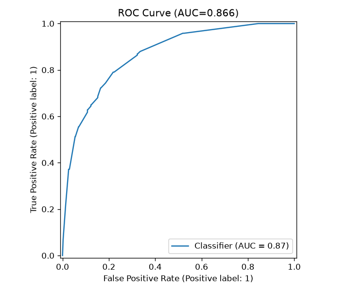
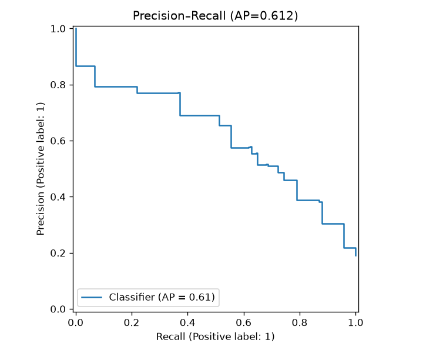
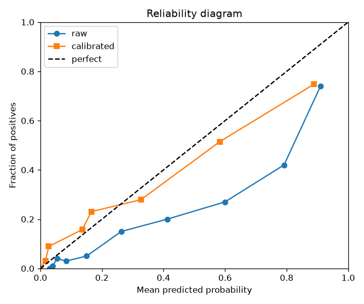
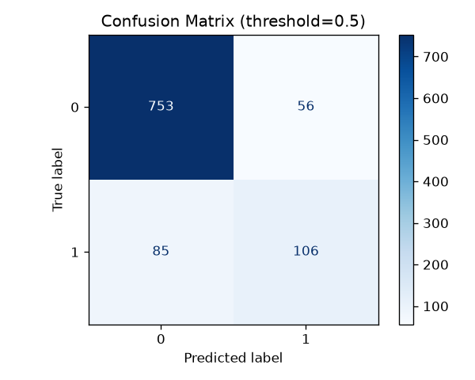
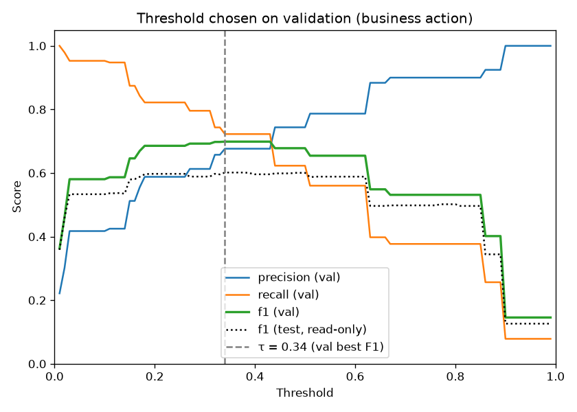

# Model card — AI platform churn (XGBoost)

_Generated: 2026-09-25 · seed=42_

## Overview

Binary classifier predicting whether a synthetic AI-platform user will churn.
Stack: XGBoost (Optuna-tuned) + post-hoc probability calibration (`isotonic`) on the validation set.

## Intended use

- Teaching / FOSS case study for churn ranking and calibrated probabilities.
- Interactive Streamlit what-if on the Santosh Shinde hero profile.
- **Not** for production decisions on real customers without fresh data validation.

## Training data

- Synthetic users from `src/retention_radar/data/generate.py` (rule-based propensity + noise). **No NaNs by design.**
- Split: train ~60% / val ~20% / test ~20% (stratified, `random_state=42`).
- n_train=3000 · n_val=1000 · n_test=1000 · n_trials=20.
- Train churn rate: `0.191`.

## Features

22 numeric features after ordinal `plan_tier` encoding.
See [data-dictionary.md](data/data-dictionary.md) for dtype, ranges, and nullability.

## Metrics (holdout) — from `models/metrics.json`

Honest ladder: **Dummy(prior) → LogReg → RF → default XGB → Optuna XGB → LightGBM → CatBoost** (calibrated XGB is the Santosh / serving hero). No simple-rule baseline is logged. GBDT trilogy peers: XGB / LightGBM / CatBoost.

| Model | Val AUC | Val F1 | Test AUC | Test F1 | Test PR-AUC |
|-------|---------|--------|----------|---------|-------------|
| Dummy (prior) | 0.5000 | 0.0000 | 0.5000 | 0.0000 | 0.1910 |
| Logistic regression | 0.9144 | 0.6614 | 0.8719 | 0.5783 | 0.6444 |
| Random Forest | 0.9096 | 0.6799 | 0.8685 | 0.5844 | 0.6429 |
| XGBoost (default) | 0.9061 | 0.6652 | 0.8691 | 0.5961 | 0.6382 |
| XGBoost (Optuna, raw) | 0.9133 | 0.6599 | 0.8699 | 0.5801 | 0.6415 |
| LightGBM (default) | 0.9091 | 0.6524 | 0.8648 | 0.5835 | 0.6332 |
| CatBoost (default) | 0.9145 | 0.6750 | 0.8715 | 0.5826 | 0.6355 |
| XGBoost (calibrated) | 0.9206 | 0.6781 | 0.8665 | 0.6006 | 0.6117 |

### Calibration (Brier — lower is better)

| Split | Raw Brier | Calibrated Brier |
|-------|-----------|------------------|
| val | `0.1164` | `0.0802` |
| test | `0.1382` | `0.1062` |

Method: `isotonic`.

### Operating point (calibrated test scores)

| Quantity | Value |
|----------|-------|
| Test AUC-ROC (calibrated) | `0.8665` |
| Test PR-AUC / AP | `0.6117` |
| Best F1 threshold τ (chosen on validation) | `0.34` |
| F1 at τ (validation) | `0.6987` |
| F1 at τ (test, reported once) | `0.6015` |
| F1 @ 0.5 | `0.6006` |
| Warm latency p50 / p95 (ms) | `2.01` / `2.15` |

## Result plots

Committed copies live under `results/plots/` (runtime dumps in `artifacts/`).

## Artifacts

| Path | Contents |
|------|----------|
| `models/churn_xgb.joblib` | Tuned XGBoost + metadata |
| `models/calibrator.joblib` | Validation-fit probability calibrator |
| `models/metrics.json` | Full metric dump (source of truth) |
| `artifacts/roc_curve.png` | ROC |
| `artifacts/pr_curve.png` | Precision–Recall |
| `artifacts/calibration_curve.png` | Reliability diagram |
| `artifacts/confusion_matrix.png` | Confusion @ 0.5 |
| `artifacts/threshold_f1.png` | Threshold vs F1 / precision / recall |
| `results/plots/*.png` | Committed copies of the same plots |

## Ethical notes

- Labels and features are synthetic; do not treat scores as real risk.
- Calibration improves probability meaning but does not fix selection bias.
- SHAP explains this score, not causation.
- Single-record path is HITL only (`auto_action: none`) — see [single-record-checklist.md](case-study/single-record-checklist.md).

## Related reading

- [ARCHITECTURE.md](ARCHITECTURE.md) — SOLID package map
- [data-dictionary.md](data/data-dictionary.md)
- [BEST_PRACTICES.md](guides/BEST_PRACTICES.md)
- [santosh-case-study.md](case-study/santosh-case-study.md)
- [ALGORITHM_LANDSCAPE.md](guides/ALGORITHM_LANDSCAPE.md) — what is on the ladder vs deferred
- [../results/BENCHMARKS.md](../results/BENCHMARKS.md)
- [../results/SANTOSH_ANALYSIS.md](../results/SANTOSH_ANALYSIS.md)
