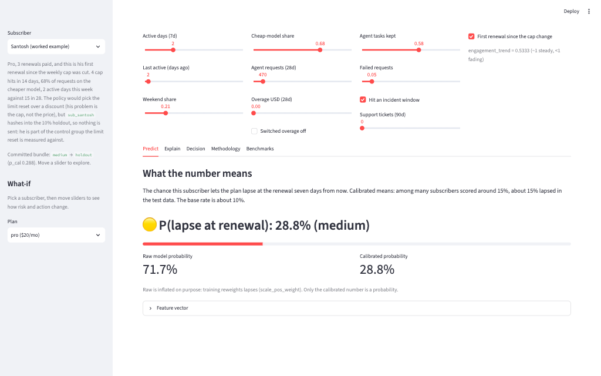
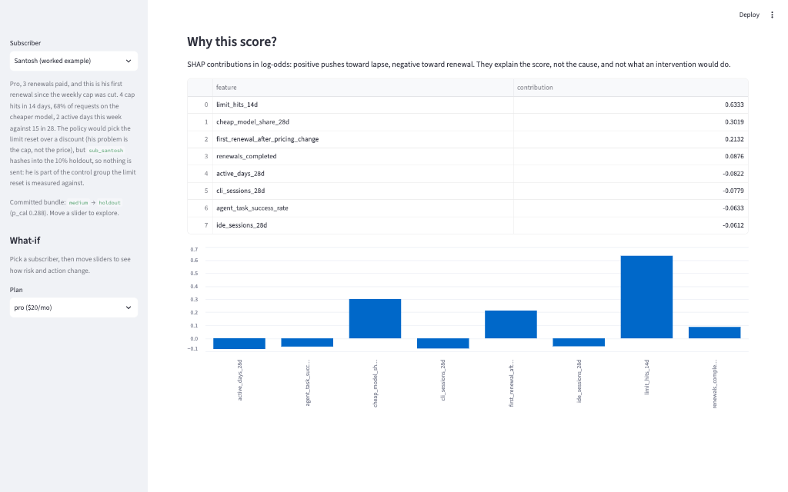

# Documentation

## Start here

| Doc | Purpose |
|-----|---------|
| [use-case.md](use-case.md) | What is modelled, why, and the sources behind it |
| [guides/start-here.md](guides/start-here.md) | Clone, run one command, what to read next |
| [getting-started.md](getting-started.md) | Install, run, score, walk one renewal day |
| [folder-structure.md](folder-structure.md) | Where things live |
| [architecture.md](architecture.md) | Train and serve boundary, module map |
| [model-card.md](model-card.md) | Intended use, data, training setup, seed-42 metrics, holdout design, limitations, versioning |

## Guides

| Doc | Purpose |
|-----|---------|
| [guides/best-practices.md](guides/best-practices.md) | Checklist for changes to this repo |
| [guides/algorithm-landscape.md](guides/algorithm-landscape.md) | Models on the ladder and models left out |
| [guides/deploy-later.md](guides/deploy-later.md) | Streamlit Community Cloud steps |
| [guides/e2e-free-platforms.md](guides/e2e-free-platforms.md) | Running everything on free platforms |

## Data

| Doc | Purpose |
|-----|---------|
| [data/data-dictionary.md](data/data-dictionary.md) | The 24-field record: types, ranges, meaning |
| [data/data-foundation-lakehouse.md](data/data-foundation-lakehouse.md) | Building the same table from events in local-data-lakehouse |

## Case study

| Doc | Purpose |
|-----|---------|
| [case-study/renewal-worked-examples.md](case-study/renewal-worked-examples.md) | Santosh and Arjun through the serve path |
| [case-study/single-record-checklist.md](case-study/single-record-checklist.md) | What one T-7 record goes through |

## Screenshots

Headless Chrome captures of `make ui` (Streamlit) on the committed seed-42 bundle with
`CHURN_DATA_SOURCE=synthetic`, taken 2026-10-03. The worked example is Santosh.

| | | |
|---|---|---|
|  |  |  |
| Predict: raw 71.7%, calibrated 28.8% (medium) | Explain: `limit_hits_14d` pushes the score up most | Decision: eligible, but in the 10% holdout, so nothing is sent |

## Results (repo root)

[`../results/`](../results/): benchmarks (including run times), worked examples, plots, and the lakehouse consume run
([`lakehouse-consume-e2e.md`](../results/lakehouse-consume-e2e.md)).
