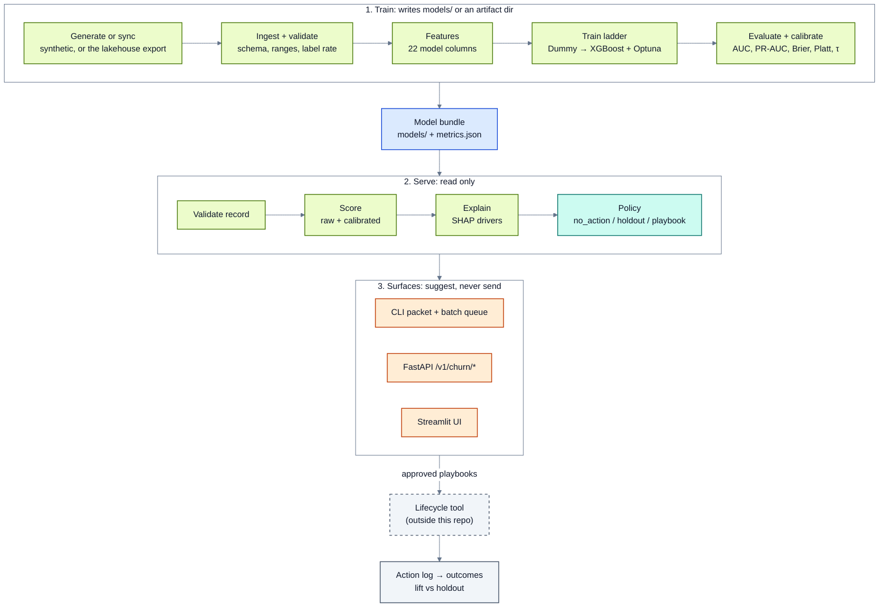

# Architecture

How a T-7 renewal record becomes a score and a suggested action, and where the line
between training and serving sits. Related: [model-card.md](model-card.md) ·
[use-case.md](use-case.md) · [../results/benchmarks.md](../results/benchmarks.md).

Everything is open source: Python, pandas, scikit-learn, XGBoost, LightGBM, CatBoost,
Optuna, SHAP, FastAPI, Streamlit.

## Flow

Train once, then serve read-only from the committed bundle. Diagram rules: [diagrams.md](diagrams.md).

The service stops at the suggestion (dashed: outside this repo). A lifecycle or messaging tool runs the approved
playbook; the service only records what was done (`action_log`) and later measures it
(`outcomes`).

## Train and serve boundary

- Train may write models, metrics, plots and the calibrator.
- Serve loads the bundle. It never fits an encoder, runs Optuna, or builds labels.
- Shared contract: the 22 feature names in `models/feature_names.json`, the record schema
  in `configs/schemas/user_record.schema.json`, τ and the band edges.

## Pipeline stages

| Stage | What it does | Output |
|-------|--------------|--------|
| Generate | 8,000 synthetic renewals; routes failed cards to dunning and scheduled cancels to the cancel flow | `data/raw/renewals_all.csv`, `renewals_t7.csv`, `subscribers/*.json` |
| Ingest | Schema, ranges, label rate; fails loud on nulls or unknown plans | clean table |
| Features | Encode `plan_tier`, build X and y | 22 model columns |
| Train | Split, ladder, Optuna on validation AUC | `churn_xgb.joblib` |
| Evaluate | AUC, PR-AUC, Brier, calibration, τ on validation, test read once | `metrics.json`, plots |
| Benchmark | Warm single-row latency | `metrics.json` |
| Packet | Validate → score → explain → cohort → decide | `artifacts/<id>_decision_packet.json` |
| Batch | CSV → ranked action queue + rejects | `cli.batch_score` |
| API | `POST /v1/churn/score`, `/v1/churn/batch`, `/v1/churn/actions` | `serving/api.py` (no auth) |
| Action log | Append what was done, including holdout and suppressions | `cli.action_log` |
| Outcomes | Join the log to renewal outcomes; lift per playbook vs holdout | `cli.outcomes` |
| Drift | z-score of the current table against training stats | `cli.drift_check` |

## Modules

| Module | Responsibility |
|--------|----------------|
| `config.py` | Paths, seed, feature contract, plans and prices, playbooks, band edges, holdout share |
| `protocols.py` | Small interfaces: classifier, calibrator, transformer, decision policy |
| `data/generate.py` | Synthetic renewal cohort, routing, the two worked examples |
| `data/ingest.py` | Load and validate the model table |
| `data/use_cases.py` | Build and check the `data/use_cases/` pack against the committed bundle |
| `features/transform.py` | Encode `plan_tier`, build the feature matrix |
| `training/split.py`, `baselines.py`, `train.py` | Split, ladder peers, XGBoost + Optuna |
| `training/calibrate.py` | Platt (sigmoid) calibrator; isotonic is supported but not used |
| `evaluation/` | Metrics, plots, τ sweep, slices by plan, latency, reproduction check |
| `serving/scoring.py` | Model + calibrator → raw and calibrated probabilities |
| `serving/infer.py` | Load the bundle, score one record |
| `serving/explain.py` | Top SHAP drivers, gain-importance fallback |
| `serving/policy.py` | Risk band, holdout assignment, expected value per playbook, the decision |
| `serving/packet.py` | Normalise, validate, assemble the decision packet |
| `serving/batch_score.py` | Vectorised batch scoring into a ranked queue |
| `serving/action_log.py` | Append-only action log (single row or bulk import of a send export) |
| `serving/outcomes.py` | Lapse per band, lift vs holdout with a Newcombe interval |
| `serving/api.py` | Thin FastAPI wrapper over the same validation, scoring and policy |
| `serving/drift.py` | Lite drift check |
| `app/streamlit_app.py` | UI over the same packet; loads committed models only |
| `docs_gen.py` | Writes the model card and data dictionary from `metrics.json` and the schema |

Callers depend on the interfaces in [`protocols.py`](../src/retention_radar/protocols.py),
so Dummy, logistic regression and XGBoost can be swapped at score time, and the policy
can be replaced without touching scoring.

## The decision

`serving/policy.py::decide` takes the calibrated probability, τ (0.16, best F1 on
validation) and the record:

1. Below τ: `no_action`.
2. In the 10% holdout (hash of `user_id`): `holdout`. Nothing is sent; the row is the
   comparison group.
3. Otherwise: the eligible playbook in `config.PLAYBOOKS` with the highest expected
   value, or `no_action` if none is positive.

`auto_action` is always `none`. `hitl_required` is true only for `personal_email`, the one
playbook a person writes, offered only on Ultra. Band edges (0.10 / 0.30) are for display
and reporting; they do not drive the decision.

## Committed artifacts

| File | Used by |
|------|---------|
| `models/churn_xgb.joblib` | every serve surface |
| `models/calibrator.joblib` | calibrated probability |
| `models/feature_names.json` | feature order |
| `models/feature_stats.json` | outlier flags, drift reference, cohort-percentile fallback |
| `models/metrics.json` | model card, UI, docs |
| `results/santosh_decision_packet.sample.json` | example packet |

`tests/test_seed42_canary.py` scores Santosh and Arjun against the committed bundle and
fails if either result moves.

## Out of scope

Billing or CRM integration, sending messages, authentication, multi-tenant serving, GPU
serving, feature stores, AutoML, the Teams plan.
