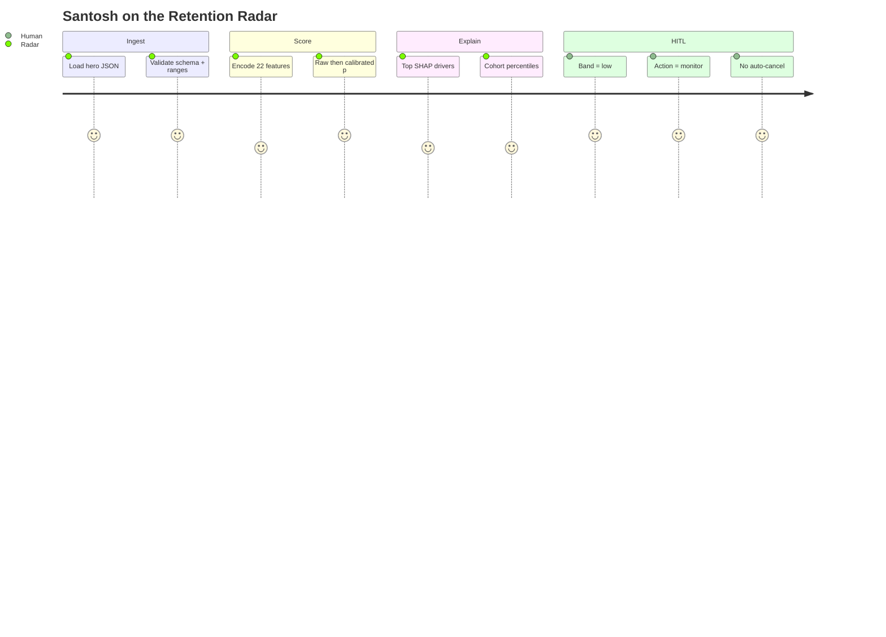
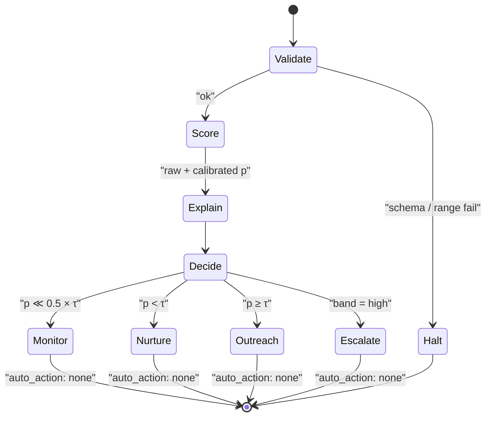

# Santosh Shinde — Retention Radar Case Study

End-to-end walkthrough of one JSON record through the AI-platform **Retention Radar**:
**validate → score (raw + calibrated) → explain → cohort compare → HITL decision**.

**Reproduce:** `./scripts/run_all.sh` → `artifacts/santosh_decision_packet.json`  
**Seed:** 42 · **Synthetic only** — not a real person score.


*Flight checklist: validate → score → explain → HITL decide — never auto-cancel. Full narrative: [../results/SANTOSH_ANALYSIS.md](../../results/SANTOSH_ANALYSIS.md).*






---


## Score context (holdout charts)

Santosh’s low calibrated score sits in the context of these ranking/calibration plots:


## 1. Who is Santosh in this repo?

Santosh is the **hero inference user**: a Pro-plan power user with mild friction and a slightly cooling engagement trend — a **whisper**, not a slammed door. His profile is:

- Row 0 of `data/raw/users.csv` (training population includes him)
- Inference payload `data/raw/santosh_shinde.json` (no `churned` label)
- Default form in Streamlit (**Decision** tab + what-if sliders)

---

## 2. Feature factors (post-retrain schema)

### Classic product signals

| Field | Value | Notes |
|-------|------:|-------|
| `days_since_signup` | 420 | Mature account |
| `sessions_last_7d` / `sessions_last_30d` | 9 / 38 | Solid usage |
| `avg_session_minutes` | 28.5 | Deep sessions |
| `models_used_count` | 7 | Broad model adoption |
| `api_calls_last_30d` | 1850 | Integration intensity |
| `tokens_consumed_last_30d` | 420000 | High token burn |
| `tools_used_count` | 8 | Platform citizen |
| `failed_requests_rate` | 0.12 | Mild friction |
| `support_tickets_last_90d` | 2 | Some pain |
| `plan_tier` | `pro` | Mid–high commercial tier |
| `payment_failures_last_90d` | 1 | One dunning event |
| `feature_adoption_score` | 0.78 | Strong adoption |
| `nps_score` | 7.0 | Neutral, not promoter |
| `last_active_days_ago` | 8 | Slightly cold |
| `weekend_usage_ratio` | 0.22 | Habit signal |

### New AI-churn / B2B factors

| Field | Value | Meaning |
|-------|------:|---------|
| `engagement_trend` | **0.9474** | Mild cooling (&lt;1) |
| `spend_usd_last_30d` | **189.0** | Synthetic Pro monthly spend |
| `days_until_renewal` | **21** | Approaching billing window |
| `agent_runs_last_30d` | **52** | AI-native automation use |
| `ide_plugin_sessions_last_30d` | **28** | IDE plugin habit |
| `seat_utilization` | **0.72** | Team seats mostly used |

Mild-whisper story: cooling trend + near renewal + one payment failure + 8 days inactive — offset by high adoption, agents, IDE use, and spend.

---

## 3. Decision packet (reference run)

```bash
python -m retention_radar.cli.single_record --user santosh --out artifacts/santosh_decision_packet.json
```

### Validation

- Required keys present ✅
- `plan_tier` ∈ {free, starter, pro, enterprise} ✅
- Ranges vs `FEATURE_RANGES` / schema ✅
- Soft check: `engagement_trend` matches sessions formula ✅

### Scoring

| Quantity | Value |
|----------|------:|
| Raw P(churn) | **0.043** |
| Calibrated P(churn) | **0.017** |
| Risk band | **low** |
| Best-F1 threshold | **0.34** |
| Half-threshold | **0.17** |

Probability is a **budget for attention**, not destiny — Santosh’s calibrated score is far below τ.

### Explanation (top SHAP-style drivers)

**Non-causal caveat:** SHAP (and gain-style fallbacks) explain **why this score moved**, not what would happen if CS changed a product lever. A large negative contribution from `feature_adoption_score` does **not** prove that “raising adoption will prevent churn.” Treat drivers as a flight checklist for a human, not as a causal graph.

Positive → toward churn; negative → toward retain (this run is protective-dominant):

1. `feature_adoption_score` (−)
2. `support_tickets_last_90d` (−)
3. `last_active_days_ago` (−)
4. `agent_runs_last_30d` (−)
5. `failed_requests_rate` (−)

### Cohort compare (vs `users.csv`)

| Feature | Value | Approx. percentile |
|---------|------:|-------------------:|
| `sessions_last_30d` | 38 | ~93rd |
| `feature_adoption_score` | 0.78 | ~99th |
| `spend_usd_last_30d` | 189 | ~92nd |
| `engagement_trend` | 0.95 | ~47th (middle — mild cool) |
| `failed_requests_rate` | 0.12 | ~23rd |
| `last_active_days_ago` | 8 | ~12th (more recent than most) |

### HITL action

**`monitor`** — calibrated P(churn) ≪ 0.5 × best-F1 threshold.  
`auto_action = none` · human-in-the-loop only · **no auto-cancel**.

Action ladder used by `src/single_record.py`:

| Condition | Action |
|-----------|--------|
| P &lt; 0.5 × τ | monitor |
| P &lt; τ | nurture / check-in |
| P ≥ τ | retention outreach (human review) |
| risk band = high | escalate (still HITL) |

---

## 4. Model context (same seed-42 retrain)

| Model | Test AUC | Notes |
|-------|----------|-------|
| Dummy (prior) | **0.500** | Never predicts churn |
| Logistic regression | **0.872** | Strong on additive synthetic label — celebrate the near-win |
| XGBoost default | **0.869** | Sane hyperparameters |
| XGBoost Optuna (raw) | **0.870** | Teaching + SHAP vehicle |

| Calibration | Value |
|-------------|------:|
| Brier raw (test) | **0.138** |
| Brier calibrated (test) | **0.106** |
| Method | isotonic on validation |
| Latency p50 | **~2.0 ms** (see `metrics.json` → `latency`) |
| Features | **22** |

Full dump: `models/metrics.json`. Always prefer a fresh run over prose.

---

## 5. UX path

1. CLI packet (above)
2. Streamlit → **Decision** tab: validation, raw vs cal, threshold, HITL, cohort bars, top drivers
3. Docs: this case study + [single-record-checklist.md](single-record-checklist.md) · [../results/SANTOSH_ANALYSIS.md](../../results/SANTOSH_ANALYSIS.md)

---

## 6. Batch, drift, and slice diagnostics (FOSS extras)

- **Batch CLI:** `python -m retention_radar.cli.single_record --dir path/to/jsons` → `artifacts/batch_decision_packets.jsonl`
- **Lite drift:** `python -m retention_radar.cli.drift_check` → `artifacts/drift_report.json`
- **Slice metrics:** per-`plan_tier` diagnostics in `metrics.json` — **educational only, not a fairness audit**
- **CI:** GitHub Actions uses `N_USERS=800` / `N_OPTUNA_TRIALS=5`

---

## Related

- [../results/SANTOSH_ANALYSIS.md](../../results/SANTOSH_ANALYSIS.md) — Single-record outcome (seed-42)  
- [../results/BENCHMARKS.md](../../results/BENCHMARKS.md) — Published ladder tables  
- [data-dictionary.md](../data/data-dictionary.md) · [MODEL_CARD.md](../MODEL_CARD.md)  
- [ARCHITECTURE.md](../ARCHITECTURE.md) · [single-record-checklist.md](single-record-checklist.md)
