# Data foundation: local-data-lakehouse

The synthetic generator in this repo produces the T-7 renewal table directly.
[local-data-lakehouse](https://github.com/santoshshinde2012/local-data-lakehouse) builds
the same table the way a real team would: from raw billing and usage events, through
bronze and silver, into a gold feature table as of each subscriber's T-7 date.

## How the data flows

The lakehouse builds and checks the export; this repo syncs it, validates it and scores it with the
committed bundle (or retrains on it with `make run-lakehouse`).

```mermaid
%%{init: {"theme": "base", "flowchart": {"wrappingWidth": 360}, "themeVariables": {"primaryColor": "#CCFBF1", "primaryTextColor": "#0F172A", "primaryBorderColor": "#0F766E", "lineColor": "#64748B", "textColor": "#0F172A", "edgeLabelBackground": "#FFFFFF", "clusterBkg": "#FFFFFF", "clusterBorder": "#64748B", "titleColor": "#0F172A", "attributeBackgroundColorOdd": "#FFFFFF", "attributeBackgroundColorEven": "#F0FDFA", "relationColor": "#64748B", "relationLabelBackground": "#FFFFFF", "relationLabelColor": "#0F172A"}}}%%
flowchart LR
  subgraph lake ["local-data-lakehouse"]
    EV["Bronze events<br/>billing + usage<br/>(make churn-sample)"]
    SP["Spark 4.1.3 + Iceberg 1.12<br/>bronze → silver → gold<br/>(make churn-e2e)"]
    CAT["Lakekeeper REST catalog<br/>+ RustFS object store"]
    EXP["data/export/<br/>churn_user_features.csv<br/>hero_inference_record.json<br/>churn_renewals_audit.csv"]
    CON["Export contract<br/>check_churn_export.py --strict"]
  end
  subgraph radar ["retention-radar"]
    SYNC["Sync + ingest<br/>CHURN_DATA_SOURCE=lakehouse"]
    MOD["Committed model bundle<br/>models/ (seed 42)"]
    SC["Batch score<br/>ranked action queue"]
    PK["Decision packet<br/>score, band, drivers, action"]
  end
  EV --> SP
  SP -->|"commits Iceberg tables"| CAT
  SP --> EXP
  EXP --> CON
  CON -->|"radar_consume.sh"| SYNC
  SYNC --> SC
  MOD --> SC
  SC --> PK
  classDef storage fill:#DBEAFE,stroke:#1D4ED8,color:#0F172A,stroke-width:1.5px
  classDef catalog fill:#FEF3C7,stroke:#B45309,color:#0F172A,stroke-width:1.5px
  classDef compute fill:#ECFCCB,stroke:#4D7C0F,color:#0F172A,stroke-width:1.5px
  classDef orchestration fill:#FCE7F3,stroke:#BE185D,color:#0F172A,stroke-width:1.5px
  classDef graphlayer fill:#CCFBF1,stroke:#0F766E,color:#0F172A,stroke-width:1.5px
  classDef consumer fill:#FFEDD5,stroke:#C2410C,color:#0F172A,stroke-width:1.5px
  classDef data fill:#F1F5F9,stroke:#475569,color:#0F172A,stroke-width:1.5px
  class EV,EXP data
  class SP compute
  class CAT catalog
  class CON graphlayer
  class SYNC,SC compute
  class MOD storage
  class PK consumer
```



## Required export (v2 contract)

This repo reads two files from the lakehouse export directory:

| File | Contents |
|------|----------|
| `churn_user_features.csv` | One row per subscriber at T-7: the 24 fields in `configs/schemas/user_record.schema.json` (22 features + `user_id`, `user_name`) plus `churned` |
| `hero_inference_record.json` | One scoring-time record with the same 24 fields and no label |

Only voluntary lapses count as `churned = 1`. Renewals lost to a failed card and
subscribers who scheduled a cancel before T-7 must be left out of the table, as in the
synthetic generator.

The lakehouse writes this contract from raw
billing and usage events, computing every feature as of each renewal's T-7 and deriving the
label from billing events. The last run, recorded in
[`results/lakehouse_e2e_summary.json`](../../results/lakehouse_e2e_summary.json):
7,387 renewals routed to the model (7.4% voluntary lapse), calibrated test AUC 0.726, and
Santosh's event-built record scored 0.774 raw → 0.210 calibrated, medium, `holdout` (his id falls in the
10% control group; the limit reset is what he would have got). Those
numbers are a different world from the synthetic run and are not the published ladder.

## Path

```text
bronze (subscriptions, invoices, usage events, tickets)
  → silver
  → gold churn_user_features (as of T-7)
  → data/export/churn_user_features.csv + hero_inference_record.json
  → retention-radar/data/external/        (scripts/sync_lakehouse_exports.sh)
  → train / calibrate / score
```

The lakehouse owns the features. Model choice lives in this repo
([algorithm-landscape.md](../guides/algorithm-landscape.md)).

## Choosing the source

`CHURN_DATA_SOURCE`:

- `synthetic`: the seed-42 generator. `run_all.sh` defaults to this so a leftover export
  cannot change the published numbers. CI always uses it.
- `lakehouse`: require `data/external/churn_user_features.csv`.
- `auto`: use `data/external/` if present, else synthetic.

With `lakehouse` (or `auto` and an export present), `--user santosh` scores
`hero_inference_record.json` instead of `data/raw/subscribers/santosh.json`.

## One command

With the lakehouse repo beside this one (or pass its path):

```bash
./scripts/run_lakehouse_e2e.sh /path/to/local-data-lakehouse
```

Steps: generate the lakehouse sample (`N_USERS`, default 8000; `CHURN_SEED=42`) → build
gold locally with pandas (no Docker) → sync the export → `CHURN_DATA_SOURCE=lakehouse
./scripts/run_all.sh` → write `results/lakehouse_e2e_summary.json`.

The run sets `RETENTION_RADAR_ARTIFACT_DIR=artifacts/lakehouse_run`, so models, metrics,
packets and the generated model card land there. Committed `models/` and
`docs/model-card.md` are not touched. It does rewrite the committed summary file;
`git checkout -- results/lakehouse_e2e_summary.json` if you do not mean to publish it.

Sync only, no retrain:

```bash
./scripts/sync_lakehouse_exports.sh /path/to/local-data-lakehouse/data/export
```

## Limits

- Lakehouse numbers come from events aggregated by the lakehouse jobs, not from the
  seed-42 generator. Do not put them in the same table as the published results.
- The published `models/metrics.json` is always the synthetic run.

Related: [data-dictionary.md](data-dictionary.md) ·
[e2e-free-platforms.md](../guides/e2e-free-platforms.md)

A recorded end-to-end run (lakehouse Spark export → sync → ingest → batch score, 7,387 rows) is in
[../../results/lakehouse-consume-e2e.md](../../results/lakehouse-consume-e2e.md).
