# Diagrams: palette and rules

Every Mermaid diagram in this repo uses one palette and one set of syntax rules, shared with
[local-data-lakehouse](https://github.com/santoshshinde2012/local-data-lakehouse/blob/main/docs/diagrams.md),
so diagrams that span both repos look the same. `tests/test_mermaid_diagrams.py` checks every
```` ```mermaid ```` block in the tracked Markdown files (and any `.mmd` file) against this page.

## Palette

Each kind of part has one colour. All text is dark (`#0F172A`) on a light fill, and every pair passes
WCAG AA (text contrast 14.6:1 to 16.5:1). Edges are `#64748B`: 4.8:1 on white and 4.0:1 on GitHub's
dark background. Subgraphs are white with a `#64748B` border, so their titles read the same in
GitHub's light and dark modes.

| `classDef` | Fill | Border | In this repo | In the lakehouse |
|---|---|---|---|---|
| `storage` | `#DBEAFE` | `#1D4ED8` | the model bundle (`models/`), artifact dirs | RustFS, SILO, Iceberg tables |
| `catalog` | `#FEF3C7` | `#B45309` | contracts: record schema, feature names, τ | Lakekeeper, its Postgres |
| `compute` | `#ECFCCB` | `#4D7C0F` | ingest, features, training, scoring, SHAP | Spark, Trino, DuckDB, PyIceberg, Polars |
| `orchestration` | `#FCE7F3` | `#BE185D` | scripts, `make`, CI | Airflow |
| `graphlayer` | `#CCFBF1` | `#0F766E` | the decision policy, checks and contracts | the graph layer |
| `consumer` | `#FFEDD5` | `#C2410C` | CLI, API, Streamlit, decision packets | retention-radar, MCP servers, agents |
| `data` | `#F1F5F9` | `#475569` | CSV and JSON files, logs, outside systems | files and exports |

A dashed border (`style <id> stroke-dasharray:5 5`) marks an optional or outside part.

## Rules

- The first line of every diagram is the shared `%%{init: …}%%` line (copy it from any diagram). Next
  comes `flowchart LR` or `flowchart TB` (or `erDiagram`), then all seven `classDef` lines exactly as
  above, then `class` statements. Only `style … stroke-dasharray:5 5` is allowed as an inline style.
- Prefer left to right. Use `subgraph` for a stage; inside a subgraph, `direction LR` works only when
  no node in it links outside, so link the subgraph itself when the edge means the whole stage.
- Quote every label and every edge label (`A -->|"approved playbooks"| B`). The only HTML allowed is
  `<br/>`; GitHub strips the rest.
- Render after every change with mermaid-cli 12:
  `npx -y @mermaid-js/mermaid-cli@12.0.0 -i docs/architecture.md -o /tmp/architecture.png -s 2 -b white`
  (a Markdown input renders each block to its own numbered file).

## Example

The lakehouse-to-radar flow, as used in the README and
[data/data-foundation-lakehouse.md](data/data-foundation-lakehouse.md):

```mermaid
%%{init: {"theme": "base", "flowchart": {"wrappingWidth": 360}, "themeVariables": {"primaryColor": "#CCFBF1", "primaryTextColor": "#0F172A", "primaryBorderColor": "#0F766E", "lineColor": "#64748B", "textColor": "#0F172A", "edgeLabelBackground": "#FFFFFF", "clusterBkg": "#FFFFFF", "clusterBorder": "#64748B", "titleColor": "#0F172A", "attributeBackgroundColorOdd": "#FFFFFF", "attributeBackgroundColorEven": "#F0FDFA", "relationColor": "#64748B", "relationLabelBackground": "#FFFFFF", "relationLabelColor": "#0F172A"}}}%%
flowchart LR
  subgraph lake ["local-data-lakehouse"]
    EV["Bronze events<br/>billing + usage<br/>(make churn-sample)"]
    SP["Spark 4.1.3 + Iceberg 1.12<br/>bronze → silver → gold<br/>(make churn-e2e)"]
    CAT["Lakekeeper REST catalog<br/>+ RustFS object store"]
    EXP["data/export/<br/>churn_user_features.csv<br/>hero_inference_record.json<br/>churn_renewals_audit.csv"]
    CON["Export contract<br/>check_churn_export.py --strict"]
  end
  subgraph radar ["retention-radar"]
    SYNC["Sync + ingest<br/>CHURN_DATA_SOURCE=lakehouse"]
    MOD["Committed model bundle<br/>models/ (seed 42)"]
    SC["Batch score<br/>ranked action queue"]
    PK["Decision packet<br/>score, band, drivers, action"]
  end
  EV --> SP
  SP -->|"commits Iceberg tables"| CAT
  SP --> EXP
  EXP --> CON
  CON -->|"radar_consume.sh"| SYNC
  SYNC --> SC
  MOD --> SC
  SC --> PK
  classDef storage fill:#DBEAFE,stroke:#1D4ED8,color:#0F172A,stroke-width:1.5px
  classDef catalog fill:#FEF3C7,stroke:#B45309,color:#0F172A,stroke-width:1.5px
  classDef compute fill:#ECFCCB,stroke:#4D7C0F,color:#0F172A,stroke-width:1.5px
  classDef orchestration fill:#FCE7F3,stroke:#BE185D,color:#0F172A,stroke-width:1.5px
  classDef graphlayer fill:#CCFBF1,stroke:#0F766E,color:#0F172A,stroke-width:1.5px
  classDef consumer fill:#FFEDD5,stroke:#C2410C,color:#0F172A,stroke-width:1.5px
  classDef data fill:#F1F5F9,stroke:#475569,color:#0F172A,stroke-width:1.5px
  class EV,EXP data
  class SP compute
  class CAT catalog
  class CON graphlayer
  class SYNC,SC compute
  class MOD storage
  class PK consumer
```


