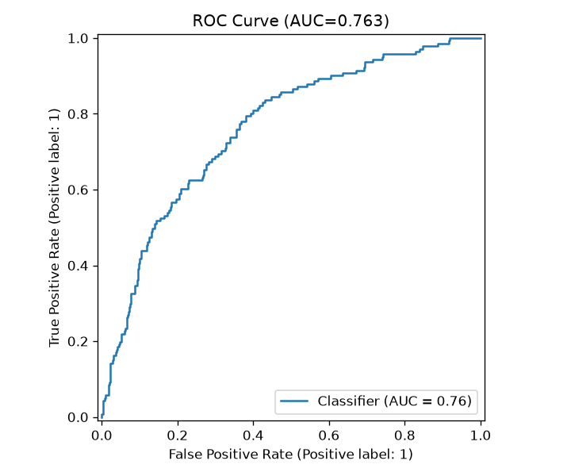
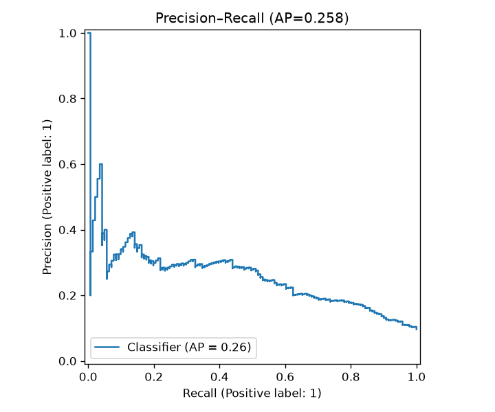
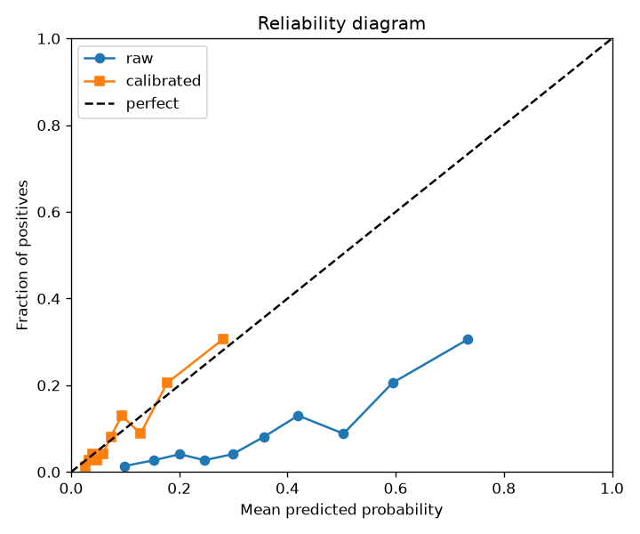
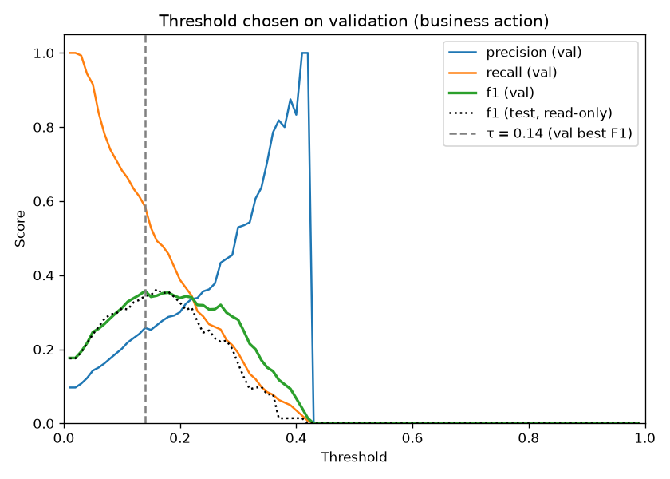
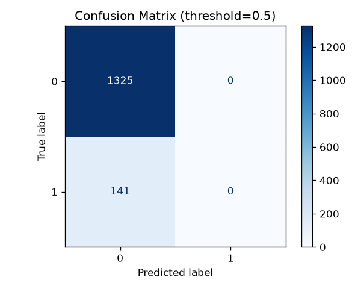

# Benchmarks (seed 42)

What the reference run produced and how to read it. Source of truth: [`../models/metrics.json`](../models/metrics.json) for metrics and
[`analysis.json`](analysis.json) (bootstrap, calibrator comparison, deciles, holdout sizes). Model card:
[`../docs/MODEL_CARD.md`](../docs/MODEL_CARD.md). Worked examples:
[`WORKED_EXAMPLES.md`](WORKED_EXAMPLES.md).

## The table under the numbers

- 8,000 synthetic renewals → 280 lost to failed cards (dunning) and 391 with a cancel already
  scheduled (cancel flow) are routed out → **7,329** T-7 rows for the model.
- Voluntary-lapse rate in the model table: **9.6%**.
- Stratified split 60/20/20: train **4,397** · validation **1,466** · test **1,466** (424 / 142 / 141 lapses).
- Optuna (20 trials) and the calibrator see validation only; test is read once.

## Table A: the ladder (test)

| Model | AUC-ROC | PR-AUC | F1 @ 0.5 | Notes |
|-------|---------|--------|----------|-------|
| Dummy (prior) | 0.500 | 0.096 | 0.000 | Accuracy 0.904 by predicting "renews" for everyone |
| **Logistic regression** | **0.781** | **0.281** | 0.333 | Best ranking on this run |
| CatBoost (default) | 0.770 | 0.281 | 0.319 | |
| XGBoost (Optuna, raw) | 0.763 | 0.258 | 0.331 | The serving model before calibration |
| Random Forest | 0.758 | 0.267 | 0.303 | |
| LightGBM (default) | 0.736 | 0.243 | 0.309 | |
| XGBoost (default) | 0.728 | 0.250 | 0.299 | |
| XGBoost (calibrated) | 0.763 | 0.258 | 0.000 | Calibration keeps the ranking; at 0.5 it flags nobody (max calibrated p = 0.41) |

**Reading it.** Logistic regression wins by 0.018 over the tuned booster. In a paired
bootstrap of the test set (2,000 resamples) it comes out ahead 96.5% of the time; the 95%
interval for the difference is −0.002 to +0.038. The generator's lapse logit is mostly
additive in its causes, and the booster's nonlinear capacity has little to find in 424
training lapses. Calibrated XGBoost still serves because the explanation and serving code
were built around it before the ladder came in; logistic regression would explain each
subscriber just as exactly (coefficient × standardised value). For a real deployment with
this result, swap it in: serving depends only on `predict_proba`.

## Table B: calibration and the operating point

| Quantity | Value |
|----------|-------|
| Brier, always predict the base rate | 0.087 |
| Brier raw (test) | 0.162 (inflated by `scale_pos_weight`) |
| Brier calibrated (test) | **0.079** |
| Calibration method | Platt (sigmoid), fit on validation |
| τ, best F1 on validation, frozen | **0.14** |
| F1 at τ: validation / test | 0.358 / 0.344 |
| At τ on test | 324 flagged (22.1%); precision 0.247; recall 0.567 |
| Top 10% of scores | captures 31.9% of lapses; 30.6% of them lapse (3.2× the base rate) |

Calibration by quintile of calibrated p (test):

| Quintile | Mean p | Observed lapse rate |
|----------|--------|---------------------|
| 1 | 0.029 | 0.020 |
| 2 | 0.043 | 0.034 |
| 3 | 0.066 | 0.061 |
| 4 | 0.111 | 0.109 |
| 5 | 0.229 | 0.256 |

**Why Platt, not isotonic.** With 142 lapses in validation, isotonic regression fit about
two dozen flat steps. Most of the queue tied, and some subscribers got a calibrated P of
exactly 0.000. Platt scaling scored better on test Brier (0.0793 vs 0.0808 for isotonic),
kept a distinct score for every subscriber, and never returns zero.

**Why the Brier gain is small.** A calibrated 0.079 against 0.087 for "always say 9.6%" is
about a 9% Brier skill. Most renewals are genuinely hard to call seven days out; the value
is concentrated in the top of the queue.

## Table C: the policy on the test set

Actions the renewal policy would take for the 1,466 test subscribers (τ = 0.14, 10% holdout,
playbook effects are **assumptions** in `config.PLAYBOOKS`):

| Action | Subscribers |
|--------|-------------|
| no_action | 1,142 |
| limit_reset | 140 |
| cancel_flow_discount | 120 |
| pause_offer | 44 |
| holdout | 19 |
| personal_email (Ultra) | 1 |

20.8% contacted. Summed expected value ≈ $975, which is only as true as the assumed effects.

**How big a holdout would it take?** Among test subscribers above τ, 24.7% lapse. With a
10% holdout (a 9:1 split), detecting the limit reset's assumed effect (24.7% → 18.5%) at 95%
confidence and 80% power takes 418 held-out and 3,762 treated subscribers, **4,180** in all.
The discount's smaller assumed effect (24.7% → 21.7%) takes 1,832 held out and 16,488 treated,
**18,320**. The limit reset is the policy's choice for 10.4% of all renewals and the discount for
8.5%, so that is roughly **40,000** and **217,000** renewals of traffic. One day of renewals,
like the use-case pack, is nowhere near either. Computed by `python -m retention_radar.cli.analysis`;
see [`analysis.json`](analysis.json).

## Table D: latency and search

| Quantity | Value |
|----------|-------|
| Warm single-row score + calibrate, p50 | ~1.5 ms (host-dependent) |
| Optuna best trial | `max_depth=4`, `n_estimators=95`, `learning_rate≈0.041` |
| Optuna best validation AUC | 0.769 |

## Plots







## Reproduce

```bash
make reproduce        # retrain into artifacts/repro/ and diff against models/metrics.json
```

## What not to claim

- Not that XGBoost beats logistic regression. It does not on this run.
- Not any real effect size for a playbook. The effects are inputs, not results.
- Not production lift. The generator encodes the mechanisms from the public record; it
  does not reproduce any company's data.
